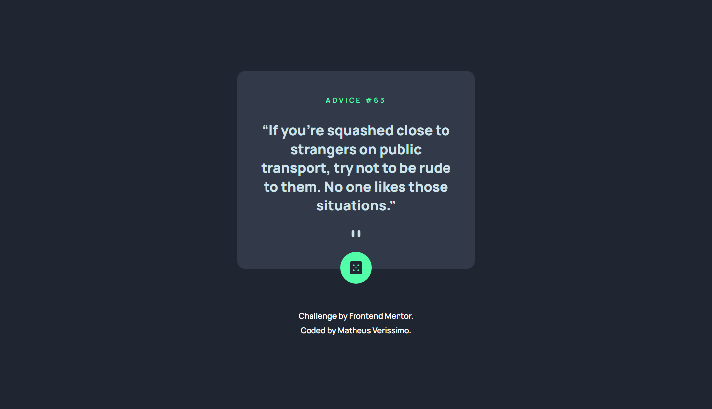
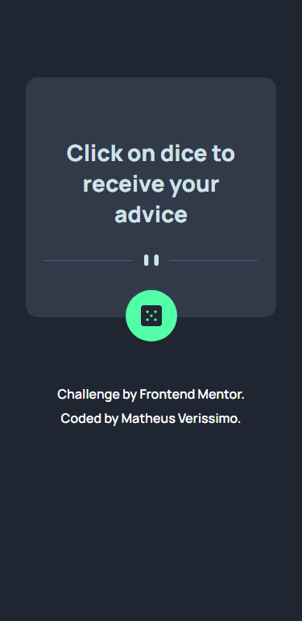

# Frontend Mentor - Advice Generator

Esta é uma solução para o [Advice generator app](https://www.frontendmentor.io/challenges/advice-generator-app-QdUG-13db).

## Screenshots

## Links

Link: https://mveryy.github.io/Advice-generator-app/

## Aprendizados

-   Consumo de API com uso do Fetch

## Construído com

-   HTML5
-   CSS3
-   JavaScript

## Autores

-   [@Mveryy](https://github.com/Mveryy)
